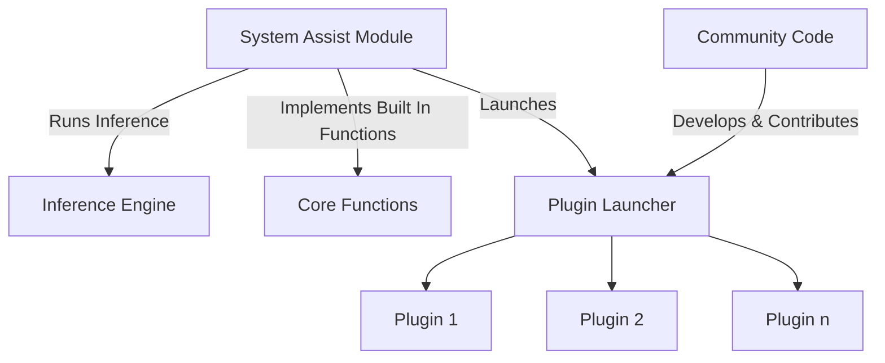

# Project G-Assist Plugins

Project G-Assist is an experimental on-device AI Assistant that helps RTX users control a broad range of PC settings, from optimizing game and system settings, charting frame rates and other key performance statistics, to controlling select peripheral lighting — all via basic voice or text commands.

Project G-Assist is built for community expansion. Whether you're a Python developer, C++ enthusiast, or just getting started — its Plugin architecture makes it easy to define new commands for G-Assist to execute. We can't wait to see what the community dreams up!

## Why Plugins Matter

- Leverage a responsive Small Language Model (SLM) running locally on your own RTX GPU
- Extend and customize G-Assist with functionality that enhances your PC experience
- Interact with G-Assist from the NVIDIA Overlay without needing to tab out or switch programs
- Invoke AI-powered GPU and system controls in your applications using C++ and python bindings
- Integrate with agentic frameworks using tools like Langflow to embed G-Assist in bigger AI pipelines

## What Can You Build?

- Python plugins for rapid development
- C++ plugins for performance-critical applications
- AI-driven features using the [ChatGPT-powered Plugin Builder](./plugins/plugin-builder/)
- Custom system interactions for hardware and OS automation
- Game and application integrations that enhance PC performance or add new commands

If you're looking for inspiration, check out our sample plugins for controlling peripheral & smart home lighting, invoking larger AI models like Gemini, managing Spotify tracks, checking stock prices, getting weather information, or even checking streamers' online status on Twitch — and then let your own ideas take G-Assist to the next level!

## Quick Start 

### Python Development with G-Assist
Get started quickly using our Python bindings of the [C++ APIs](https://github.com/NVIDIA/nvapi/blob/main/nvapi.h#L25283):

1. **Install the binding locally**
```bash
cd api/bindings/python
pip install .
```

2. **Chat with G-Assist**
```python
from rise import rise

# Initialize G-Assist connection
rise.register_rise_client()

# Send and receive messages
response = rise.send_rise_command("What is my GPU?")
print(f'Response: {response}')
"""
Response: Your GPU is an NVIDIA GeForce RTX 5090 with a Driver version of 572.83.
"""
```
3. **Extend G-Assist**


> 💡 **Requirements**:
> - Python 3.x
> - G-Assist core services installed
> - pip package manager

See our [Python Bindings Guide](./api/bindings/python/README.md) for detailed examples and advanced usage.

### NVIDIA Plugin Example - Twitch

Try these commands:
- "Hey Twitch, is Ninja live?"
- "Check if shroud is streaming"
- "Is pokimane online right now?"

### Example Responses

When a streamer is live:
```text
ninja is LIVE!
Title: Friday Fortnite!
Game: Fortnite
Viewers: 45,231
Started At: 2024-03-14T12:34:56Z
```

When a streamer is offline:
```text
ninja is OFFLINE
```

#### Key Features
- Protocol V2 with JSON-RPC 2.0 communication
- Secure API credential management
- OAuth token handling
- Comprehensive logging system
- Real-time stream status checking

#### Project Structure
```
plugins/examples/twitch/
├── manifest.json        # Plugin configuration (with protocol_version: "2.0")
├── config.json          # Twitch API credentials
├── plugin.py            # Main plugin code (uses gassist_sdk)
├── requirements.txt     # Python dependencies
└── libs/
    └── gassist_sdk/     # G-Assist SDK
```
See our [Twitch Plugin Example Code](./plugins/examples/twitch/) for a step-by-step guide to creating a Twitch integration plugin for G-Assist.


## Table of Contents
- [Project G-Assist Plugins](#project-g-assist-plugins)
- [Why Plugins Matter](#why-plugins-matter)
- [What Can You Build?](#what-can-you-build)
- [Quick Start](#quick-start)
  - [Python Development with G-Assist](#python-development-with-g-assist)
  - [NVIDIA Plugin Example - Twitch](#nvidia-plugin-example---twitch)
- [G-Assist Module Architecture](#g-assist-module-architecture)
- [Extending G-Assist (Plugins)](#extending-g-assist-plugins)
  - [Plugin Architecture](#plugin-architecture)
  - [Protocol V2 Features](#protocol-v2-features)
  - [Minimal Plugin Example](#minimal-plugin-example)
  - [Plugin Integration](#plugin-integration)
- [NVIDIA-Built G-Assist Plugins](#nvidia-built-g-assist-plugins)
- [Community-Built Plugins](#community-built-plugins)
- [Development Tools](#development-tools)
- [Need Help?](#need-help)
- [License](#license)
- [Contributing](#contributing)

## G-Assist Module Architecture



## Extending G-Assist (Plugins)

Transform your ideas into powerful G-Assist plugins! Whether you're a Python developer, C++ enthusiast, or just getting started, our plugin system makes it easy to extend G-Assist's capabilities. Create custom commands, automate tasks, or build entirely new features - the possibilities are endless!

> ⚠️ **Protocol V2**: All plugins must use Protocol V2. See the [Plugin Migration Guide](./PLUGIN_MIGRATION_GUIDE_V2.md) for details.

### Plugin Architecture

Each plugin lives in its own directory named after the plugin (this name is used to invoke the plugin):

```text
plugins/
└── myplugin/              # Plugin directory name = invocation name
    ├── plugin.py           # Main plugin code (Python) or .exe (C++)
    ├── manifest.json       # Plugin configuration
    ├── config.json         # Settings & credentials (optional)
    └── libs/               # SDK and dependencies
        └── gassist_sdk/    # G-Assist SDK (required)
```

**File Descriptions:**
- `plugin.py` or `.exe` - Main plugin executable (Python files run directly, no compilation needed)
- `manifest.json` - Plugin manifest that defines:
    - `manifestVersion` - manifest schema version (use `1`)
    - `name` - plugin identifier
    - `version` - plugin version string
    - `description` - brief description of plugin functionality
    - `protocol_version` - **required**: must be `"2.0"`
    - `executable` - name of the executable file (can be `.py` or `.exe`)
    - `persistent` - [true/false] whether plugin runs throughout G-Assist lifecycle
    - `functions` - array of available functions with:
      - `name` - function identifier
      - `description` - what the function does
      - `tags` - keywords for AI model to match user intent
      - `properties` - parameters the function accepts
      - `required` - array of required parameter names
- `config.json` - Configuration file for plugin-specific settings (API keys, credentials, etc.) ⚠️ **Add to `.gitignore`**
- `libs/gassist_sdk/` - The G-Assist SDK that handles protocol communication

> 💡 **Tip**: The plugin directory name is what users will type to invoke your plugin (e.g., "Hey myplugin, do something")

### Protocol V2 Features

Protocol V2 brings significant improvements:

| Feature | Description |
|---------|-------------|
| **JSON-RPC 2.0** | Standard protocol for interoperability |
| **Engine-driven health monitoring** | No more plugin heartbeat threads needed |
| **Length-prefixed framing** | Robust message handling (replaces `<<END>>` delimiter) |
| **Native Python support** | Run `.py` files directly without compilation |
| **SDK-based development** | ~20 lines of code instead of 200+ boilerplate |

### Minimal Plugin Example

```python
from gassist_sdk import Plugin

plugin = Plugin("hello-world", version="1.0.0")

@plugin.command("say_hello")
def say_hello(name: str = "World"):
    """Greet the user by name."""
    return f"Hello, {name}! 👋"

if __name__ == "__main__":
    plugin.run()
```

**Corresponding `manifest.json`:**

```json
{
  "manifestVersion": 1,
  "name": "hello-world",
  "version": "1.0.0",
  "description": "A simple greeting plugin",
  "protocol_version": "2.0",
  "executable": "plugin.py",
  "persistent": true,
  "functions": [
    {
      "name": "say_hello",
      "description": "Greet the user by name",
      "tags": ["greeting", "hello"],
      "properties": {
        "name": {
          "type": "string",
          "description": "Name to greet"
        }
      }
    }
  ]
}
```

### Plugin Integration
#### How to Call a Plugin from G-Assist

The manifest file acts as the bridge between G-Assist and your plugin. G-Assist automatically scans the plugin directory to discover available plugins.

#### Two Ways to Invoke Plugins:

1. **Natural Language Commands**
    ```
    What are the top upcoming games for 2025?
    ```
    The AI model automatically:
    - Analyzes the user's intent
    - Selects the most appropriate plugin
    - Chooses the relevant function to execute
    - Passes any required parameters

2. **Direct Plugin Invocation**
    ```
    Hey Logitech, change my keyboard lights to green
    ```
    - User explicitly specifies the plugin by name
    - AI model determines the appropriate function from the manifest
    - Parameters are extracted from the natural language command

> 💡 **Pro Tip**: Direct plugin invocation is faster when you know exactly which plugin you need!

## NVIDIA-Built G-Assist Plugins
Explore our official example plugins:

### AI & Information
- **[Gemini AI Integration](./plugins/examples/gemini)** - Query Google's Gemini AI for real-time information, general knowledge, and web searches

## Community-Built Plugins
Check out what others have built:
- [Your Plugin Here] - Submit your plugin using a pull request! We welcome contributions that:
  - Follow our [contribution guidelines](CONTRIBUTING.md)
  - Include proper documentation and examples
  - Have been tested thoroughly
  - Add unique value to the ecosystem

## Development Tools
- **[G-Assist SDK](./api/sdk/)** - Official SDK for Protocol V2 plugin development (Python, C++, Node.js)
- **[Plugin Migration Guide](./PLUGIN_MIGRATION_GUIDE_V2.md)** - Complete guide for migrating to Protocol V2
- **[Python Bindings](./api/bindings/python/)** - Python API for interacting with G-Assist
- **[C++ API](./api/c++/)** - Native C++ interface for performance-critical applications
- **[ChatGPT-powered Plugin Builder](./plugins/plugin-builder/)** - AI-assisted plugin development tool
- **[Cursor Rules for Plugin Development](./plugins/plugin-builder/cursor/)** - AI coding assistant rules for building G-Assist plugins in Cursor

## Need Help?
- Report issues on [GitHub](https://github.com/nvidia/g-assist)

## License
This project is licensed under the Apache License 2.0 - see the [LICENSE](LICENSE) file for details.

## Contributing
We welcome contributions! Please see our [Contributing Guide](CONTRIBUTING.md) for details.
